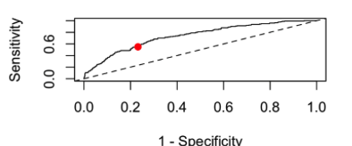
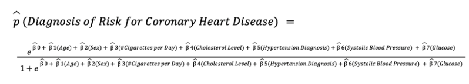

# Computational Diagnosis of Coronary Heart Disease

## Project Overview
In this project, I provide a demonstration of logistic regression to use for the 
computational diagnosis of coronary heart disease, and walk through the entire
model development process including validating assumptions, feature selection, and
monitoring accuracy.  Further testing of machine learning models is also done as
additional comparisons for propspective quantitative analysis.  

## Project Paper
[Click here](https://github.com/Solanki-Raja/Coronary-Heart-Disease/blob/main/CHD_Diagnosis_Project_Abstract.pdf) to view the project paper:

### Built With

This project was built with the following technologies:

- R
- Tidyverse
- dplyr
- ggplot
- MASS
- faraway
- pROC
- caret

## Contact

If you have any questions or suggestions, feel free to reach out to us:

- Connect with us on LinkedIn:

    

        
         
        <a href="https://www.linkedin.com/in/solankiraja/" target="_blank">Raja Solanki</a>
    

    
     
    <a href="https://www.linkedin.com/in/james-hopham-2440352a5/" target="_blank">James Hopham</a>

